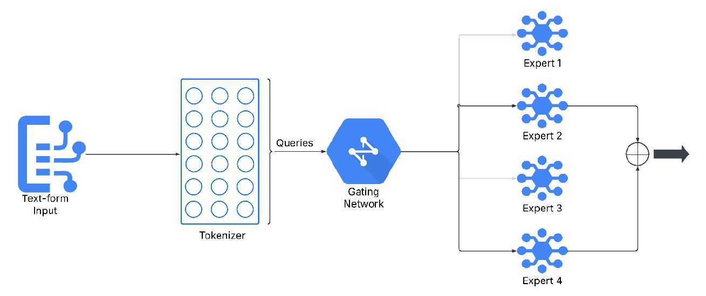

[comment]: # "This is the standard layout for the project, but you can clean this and use your own template"

# Legal Chain Resolver With Mixture of Experts and Multi-Agent System for Legal Assistance

#### Team

- E/19/310, Ranage R.D.P.R., [email](mailto:e19310@eng.pdn.ac.lk)
- E/19/426, Weerasinghe P.M., [email](mailto:e19426@eng.pdn.ac.lk)
- E/19/304, Pushpakumara R.M.S.P., [email](mailto:e19304@eng.pdn.ac.lk)

#### Supervisors

- Dr. Damayanthi Herath, [email](mailto:damayanthiherath@eng.pdn.ac.lk )
- Ms. Yasodha Vimukthi, [email](mailto:yashodhav@eng.pdn.ac.lk)

#### Table of content

1. [Abstract](#abstract)
2. [Related works](#related-works)
3. [Methodology](#methodology)
4. [Experiment Setup and Implementation](#experiment-setup-and-implementation)
5. [Results and Analysis](#results-and-analysis)
6. [Conclusion](#conclusion)
7. [Publications](#publications)
8. [Links](#links)

---

<!-- 
DELETE THIS SAMPLE before publishing to GitHub Pages !!!
This is a sample image, to show how to add images to your page. To learn more options, please refer [this](https://projects.ce.pdn.ac.lk/docs/faq/how-to-add-an-image/)
 
-->

## Abstract
The Sri Lankan legal system faces significant barriers in accessibility, affordability, and efficiency, particularly within commercial law. High legal costs, language barriers, and limited digital legal resources make timely and accurate legal assistance challenging for many, especially SMEs. Existing AI-driven legal solutions in Sri Lanka predominantly rely on Natural Language Processing (NLP), which lacks structured legal reasoning and is prone to hallucinations. This project proposes an AI-driven legal assistance framework focused on Sri Lankan commercial law, integrating a Mixture-of-Experts (MoE) model, a multi-agent system, and knowledge graphs. The system is designed to enhance legal accuracy, interpretability, and efficiency by dynamically routing legal queries to domain-specific AI experts, structuring legal knowledge, and simulating real-world legal workflows. This approach aims to provide accessible, reliable, and context-aware legal support for businesses, legal professionals, and policymakers in Sri Lanka, ultimately improving legal decision-making and compliance

## Related works
AI-driven legal assistance is an evolving field, with global advancements seen in models such as ChatLaw, LawGPT, LawNeo, and Sri Lanka’s own LawKey. Early legal AI relied on rule-based and statistical NLP systems, which struggled with legal language complexity. Modern solutions leverage deep learning and LLMs for tasks like legal text summarization and contract analysis but still face issues like hallucinations and lack of structured reasoning. ChatLaw stands out by integrating a Mixture-of-Experts (MoE) architecture, multi-agent collaboration, and knowledge graphs, significantly reducing hallucinations and improving legal reasoning. LawNeo uses composite model integration for cost-efficient domain adaptation, while LawKey focuses on accessibility within the Sri Lankan context using reinforcement learning and NLP. However, most solutions are limited by jurisdictional scope, lack of multilingual support, and insufficient explainability. These gaps motivate the development of a domain-specific, interpretable AI legal assistant tailored for Sri Lanka’s commercial law sector

## Methodology
The proposed system’s methodology is structured as follows:

- **Data Collection:** Authoritative legal documents—including statutes, case law, and regulations—are gathered from public databases, government publications, and legal archives. Expert insights are incorporated to ensure practical legal reasoning is captured

- **Retrieval-Augmented Generation (RAG) Pipeline:** Legal documents are preprocessed, embedded, and stored in a vector database. User queries are embedded and matched with relevant documents using cosine similarity, ensuring responses are grounded in authoritative texts and minimizing hallucinations

  

- **Knowledge Graph Integration:** Knowledge graphs are constructed using Named Entity Recognition (NER) and relation extraction to map entities and relationships within legal texts. This enables semantic reasoning and improves retrieval accuracy by considering both textual and relational similarities

- **Mixture-of-Experts (MoE) Model:** Queries are routed to specialized expert models (e.g., contract law, intellectual property) via a gating network. Only the most relevant experts are activated, and their outputs are aggregated to form the final response, ensuring domain-specific accuracy and computational efficiency.

  

- **Multi-Agent System:** The system simulates a virtual law firm with four specialized agents:
  - Agent 1: User query processing and problem structuring
  - Agent 2: Legal research and information retrieval (integrated with RAG)
  - Agent 3: Expert analysis and legal reasoning (using MoE)
  - Agent 4: Legal document finalization and compliance review
 
  
  
  These agents collaborate to deliver structured, accurate, and context-aware legal assistance

- **Evaluation:** The system will be benchmarked against existing legal AI tools using metrics such as accuracy, F1-score, and precision-recall, as well as through user testing with legal professionals
  
## Experiment Setup and Implementation
The implementation plan includes:

- **Data Preparation:** Collection and preprocessing of Sri Lankan commercial law documents, including tokenization, entity recognition, and vectorization.

- **Knowledge Graph Construction:** Building and updating the legal knowledge graph with extracted entities and relationships.

- **Model Training:** Fine-tuning LLMs with RAG, training the MoE model for domain specialization, and configuring the multi-agent workflow.

- **System Integration:** Developing interfaces for agent communication, integrating retrieval and generation modules, and deploying a conversational AI interface for user interaction.

- **Testing and Benchmarking:** Evaluating system performance against legal AI benchmarks and through practical case-based scenarios with expert feedback

  

## Results and Analysis
As of the current stage, full-scale evaluation and testing are pending. The system is designed to be assessed via benchmarking against existing legal AI assistants, focusing on improvements in accuracy, reliability, and contextual legal reasoning. Planned evaluation phases include comparative benchmarking, user-based testing with legal professionals, legal validation against real-world case law, and scalability assessments. The expected outcomes are enhanced accuracy, reduced misinformation, and improved usability compared to traditional NLP-based legal assistants

## Conclusion
This project addresses critical gaps in Sri Lankan legal assistance by developing an AI-powered framework that integrates Mixture-of-Experts, multi-agent systems, and knowledge graphs. The proposed solution aims to deliver reliable, interpretable, and context-aware legal support, specifically for commercial law. By leveraging structured legal knowledge and domain-specific expertise, the system seeks to improve accessibility, minimize misinformation, and support informed decision-making for businesses and legal professionals in Sri Lanka. Future work will focus on optimizing expert selection, enhancing real-time knowledge updates, and ensuring ethical compliance and data security

## Publications
[//]: # "Note: Uncomment each once you uploaded the files to the repository"

<!-- 1. [Semester 7 report](./) -->
<!-- 2. [Semester 7 slides](./) -->
<!-- 3. [Semester 8 report](./) -->
<!-- 4. [Semester 8 slides](./) -->
<!-- 5. Author 1, Author 2 and Author 3 "Research paper title" (2021). [PDF](./). -->

## Links

[//]: # ( NOTE: EDIT THIS LINKS WITH YOUR REPO DETAILS )

- [Project Repository](https://github.com/cepdnaclk/e19-4yp-Legal-Chain-Resolver-With-Mixture-of-Experts-and-Multi-Agent-System-for-Legal-Assistance)
- [Project Page](https://cepdnaclk.github.io/e19-4yp-Legal-Chain-Resolver-With-Mixture-of-Experts-and-Multi-Agent-System-for-Legal-Assistance/)
- [Department of Computer Engineering](http://www.ce.pdn.ac.lk/)
- [University of Peradeniya](https://eng.pdn.ac.lk/)

[//]: # "Please refer this to learn more about Markdown syntax"
[//]: # "https://github.com/adam-p/markdown-here/wiki/Markdown-Cheatsheet"
